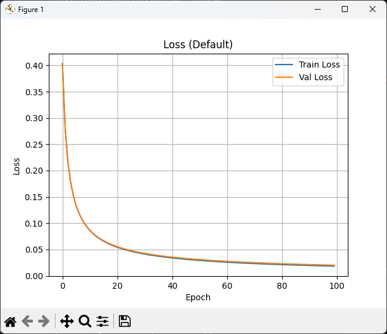
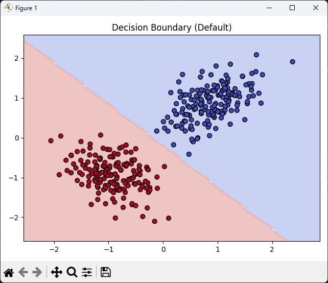
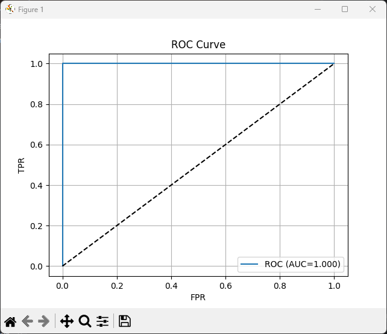
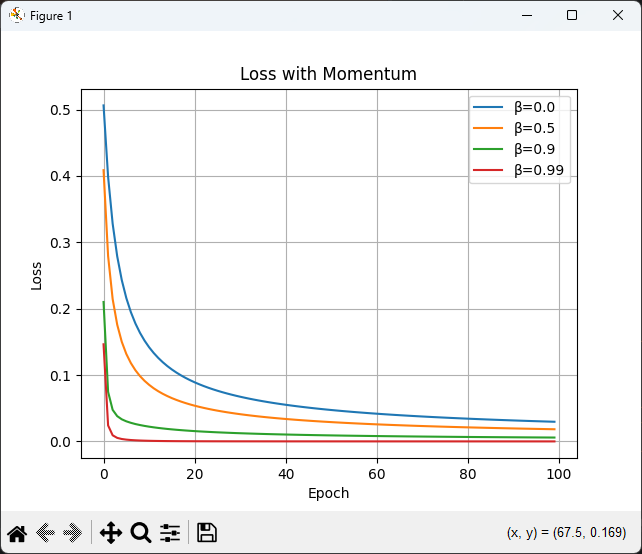

# Однослойный перцептрон

Реализация и анализ однослойного перцептрона с нуля на Python + NumPy.

---

## Требования
```bash
pip install numpy matplotlib
```

## Запуск
```bash
python main.py
```
Скрипт автоматически:
- сгенерирует данные,
- обучит модель,
- проведёт все эксперименты,
- откроет графики в отдельных окнах.

> Для сохранения графиков добавьте `plt.savefig('name.png')` перед `plt.show()` в коде.

---

## Результаты и графики

### 1. Сходимость обучения (Loss vs Epoch)
  
*График показывает плавное снижение функции потерь на train/val. Gap <1% — признак отсутствия переобучения.*

### 2. Разделяющая граница
  
*Линейная граница `wᵀx + b = 0` успешно разделяет гауссовы облака двух классов.*

### 3. Точность на разных типах данных
| Данные | Accuracy | Вывод |
|--------|----------|-------|
| Gaussian Linear | 0.993 | Линейно разделимо |
| XOR Non-linear | 0.445 | Перцептрон ограничен |
| Circle Non-linear | 0.580 | Требуется нелинейная модель |

### 4. ROC-кривая и ошибки классификации
  
*AUC ≈ 1.0. Ошибочные точки (чёрная обводка) сосредоточены у границы решения.*

### 5. Влияние момента (Momentum)
  
*β=0.9 обеспечивает наиболее быструю и стабильную сходимость.*
